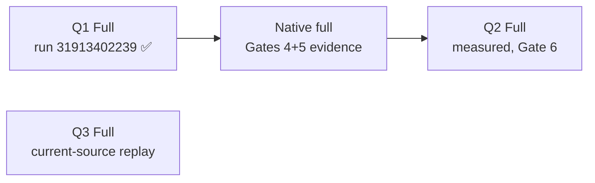

# Benchmark status — 2026-08-23 session report

Scope: reconcile `bench/protocols/` frozen preregistrations against retained evidence and hosted workflow runs, record the Native full failure root cause observed this session, and list the remaining path to Gate 6. Every claim below cites an observable source: a run ID, a file in this repository, or a verification performed on 2026-08-23 against commit `d62cd8054cf859ab85d21ddda22b02404f8d81fb` (plus retention commit `332ee77`, which adds only `bench/results/q1-closed-lab-v5-run-31913402239/`).

R8 remains a private closed-lab experimental protocol, not an Internet standard and not "IPv8" (`docs/naming-and-legal.md`).

## 1. Preregistration vs evidence reconciliation

| Preregistration | Current contract | Retained result evidence | Status |
|---|---|---|---|
| Q1 mobility | v5 `bench/protocols/q1.json` `sha256:905f2eb8…75b48` | **YES** — `bench/results/q1-closed-lab-v5-run-31913402239/`, publication eligible, first for Q1 | Result complete; package retained 2026-08-23 |
| Q2 redundancy | v5 `bench/protocols/q2.json` `sha256:709c8ae6…fe99` | None — zero observations by design | Not executed; forbidden until Gates 4/5 close (`spec/0003-test-plan.md` §4) |
| Q3 handshake | current censor-aware contract `sha256:e5a7f57a…77e1b` | Prior-source only — `bench/results/q3-closed-lab-v8` evidences commit `881826b…` and does **not** satisfy the current contract (manifest entry: "historical-prior-source-evidence-not-current-contract") | Fresh run from current source required |

Historical non-result retainages, unchanged this session: `q1-setup-failure-v2`, `q1-closed-lab-v4-invalid-run-31835854041`, `q3-closed-lab-v8`.

## 2. Q1 v5 observed outcome (retained package)

Source: `bench/results/q1-closed-lab-v5-run-31913402239/{raw.json,summary.json}`; run `31913402239` at `d62cd80`, epoch `closed-lab-epoch-260815225528`.

| Mechanism | Arm | n | failure rate | outage p50 ms (95% CI) | outage p95 ms (95% CI) |
|---|---|---:|---:|---|---|
| R8 | abrupt-break | 200 | 0.0 | 110.038803 [110.021753, 110.051968] | 110.175793 [110.149728, 110.203380] |
| R8 | make-before-break | 200 | 0.0 | 100.052691 [100.026698, 100.066566] | 100.176378 [100.139195, 100.181555] |
| TCP-reconnect | abrupt-break | 200 | 0.0 | 129.999624 [129.997590, 130.001683] | 130.042595 [130.028804, 130.053350] |
| TCP-reconnect | make-before-break | 200 | 0.0 | 120.000143 [119.997690, 120.001765] | 120.032297 [120.022655, 120.036487] |
| GARP-VIP | abrupt-break | 200 | 0.0 | 100.002123 [99.999376, 100.004376] | 100.033094 [100.024676, 100.044431] |
| GARP-VIP | make-before-break | 200 | 0.0 | 100.000793 [99.999771, 100.002997] | 100.030057 [100.024855, 100.044717] |

Raw-data facts: 1,320 rows = 6 cells × (20 warmups excluded + 200 measured); zero failures, zero duplicates, zero reorders; 602 scheduled payloads lost during outage windows across measured rows. All values above are the preregistered estimands only; no post-hoc fields were added to the package.

Verification performed at retention (commands and outputs reproducible from the package):

1. Every `manifest.json` file hash matches retained bytes.
2. All 12 implementation-source hashes match blobs at `d62cd80`.
3. Nearest-rank p50/p95 recomputed per cell from `raw.json` reproduce every `summary.json` point estimate exactly (the preregistered convention is `sorted[min(n-1,floor((n-1)q))]`; naive linear interpolation does not reproduce them).

## 3. Native full failure: root cause observed, code regression ruled out

The handoff hypothesis ("fd 정리/프로세스 재배 관련 회귀 추정") is **not supported** by the evidence:

- Failed run `31921389213` (main, 2026-08-16T02:13Z): job never started. GitHub annotation on the run reads: *"The job was not started because recent account payments have failed or your spending limit needs to be increased."* No job log exists (`gh run view --log-failed` returns `log not found: 95101682942`); startedAt→completedAt is 3 seconds.
- Re-dispatch this session, run `32651320815` (main, 2026-08-23T16:19Z): identical annotation, identical 2–5 second early failure.
- Code state: main HEAD `d62cd80` passed CI (`run 31913221867`) and its `tests/redundant_netns.py` fd handling is a hardened superset of the approach proven green on diagnostic branch commit `e68070a` (run `31912566197`, success in 2m43s). The diag branch's `native-full.yml` difference was only a hard-coded gate3 SHA for diagnosis; main uses the correct dynamic `$GITHUB_SHA` check.
- Therefore Native full has effectively never been attempted at any main commit; both failures are account-level billing blocks, which only the repository owner can clear (GitHub Settings → Billing & plans).

Preconditions for the retry are already verified: successful Q1 Full run `31913402239` exists at exactly `d62cd80`, event `workflow_dispatch`, artifact `q1-full-31913402239` unexpired (expires 2026-09-15, digest `sha256:35c6e981…6349`). Retry command once billing is cleared:

```
gh workflow run native-full.yml -f gate3_run=31913402239
```

## 4. Remaining path to Gate 6

Dependency chain observed from workflow sources:



| Step | Blocked by | Action |
|---|---|---|
| Clear Actions billing | Account owner | GitHub Settings → Billing & plans |
| Native full green | Billing | Dispatch as above; expect ~3 min based on run `31912566197` |
| Q3 fresh run | Billing (independent chain) | `gh workflow run q3-full.yml -f host_epoch=closed-lab-epoch-NNN`; required because `q3-closed-lab-v8` predates the censor-aware contract |
| Q2 Full (Gate 6) | Native full green at same commit | `gh workflow run q2-full.yml -f host_epoch=closed-lab-epoch-NNN -f gate5_run=<native run id>`; up to 6 h runtime budget |
| Docs/spec status lines | Above outcomes | Update after each green run; keep preregistered-fields-only reporting |

## 5. Constraints honored this session

- No privileged local execution attempted (no passwordless sudo locally; all privileged work stays in `workflow_dispatch` hosted runs).
- Frozen contracts untouched: `bench/protocols/*.json` bytes unchanged (hashes re-verified against manifest).
- Telemetry redaction preserved in all committed evidence (environment CPU identifiers remain redacted).
- No force-push; conventional commits; only new files added so far.

## 6. Local verification of session commits (hosted CI unavailable)

Because every Actions run this session was rejected by the account billing block, commits `332ee77..b91d90f` have no hosted CI yet. Local verification at HEAD `b91d90f`, all observed 2026-08-23:

- `python3 -m unittest discover -s tests -p 'test_*.py'`: **OK, 284 tests** (1 skip: `test_dissector` requires `tshark`, not installed locally; hosted CI covers it).
- Bounded fuzz smokes `fuzz_reference.py`, `fuzz_session.py`, `fuzz_mobility.py`, `fuzz_redundant.py`, `fuzz_redundant_state.py`: all exit 0.
- `cargo fmt --all --check`: pass. `cargo clippy --workspace --all-targets --locked -- -D warnings`: pass. `cargo test --workspace --all-targets --locked`: all test binaries `ok`, 0 failures.
- `python3 bench/q1.py regenerate` on a copy of the retained Q1 v5 package: exit 0, `summary.json` rewritten byte-identically.
- Billing block reconfirmed by dispatch attempts at 16:19Z (`32651320815`) and 16:33Z (`32652042261`), identical annotations.
